## Requirements
- jdk 11
- gradle 8.0

## Run application

Run all tests 

```
./gradlew clean test
```

Run e2e test to generate `output.csv`

```
./gradlew clean test --tests MainTest.testE2E 
```

## Architecture


## Flowchart


## Assumptions
- Application is a backend that can serve multiple clients with multiple filters. Hence data must be kept in memory and 
  not simply discarded (ie. single pass filtering won't do)
- Output row must always have both bid and ask quote. If we only have either one of them because it got filtered out, 
  then it is discarded from the output because it doesn't make sense to have either bid or ask without the counterpart

## Notes, decisions & reasoning 
- Uses single filter in the `QuotesProcessor` to make it simpler. This way you can be explicit on the root filter 
  whether it's an OR or AND filter which then can be chained
- Use Apache Commons for CSV handling as well as IOUtils. IOUtils is only used for testing to do comparison 
  between files. It has nice compare method that ignores EOL character
- Once input is processed, a `Map<Symbol, SymbolQuotes>` is created. This essentially group the result based on symbol
- `SymbolQuotes` contains 2 sorted set of quotes for both bids and asks. `Quote` is sorted ascendingly based on the 
  price, whenever we pick the first item on both bid and ask will always give the smallest amount
- Outlier filter uses standard Z Score for outlier detection. Simply using average can be problematic if 
  there is a consistent increasing/decreasing trend (especially if the trend is percentage is big) 
- Average and Standard Deviation is stored ine memory as part of `SymbolQuotes`. This way we can store the value as 
  quote is added to the object and avoid having to run through all the items everytime we want to get the average or 
  standard deviation
- Average and sum difference from mean is calculated on the fly using online function. This way if we move on to 
  streaming instead of loading the full file in memory, the logic will still work

## Potential future works
- Streaming operations
- Special treatment for Symbol Filter
- Introduce limit as post-filter (e.g. limit only first X result or limit only first X result per symbol)
